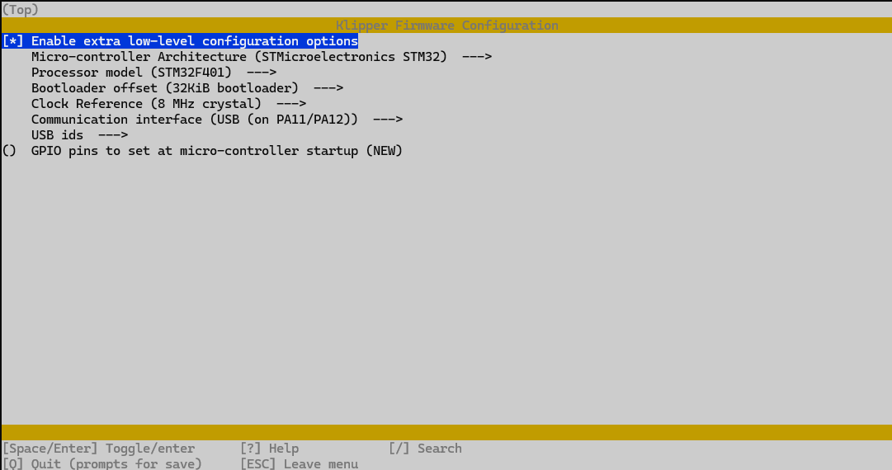
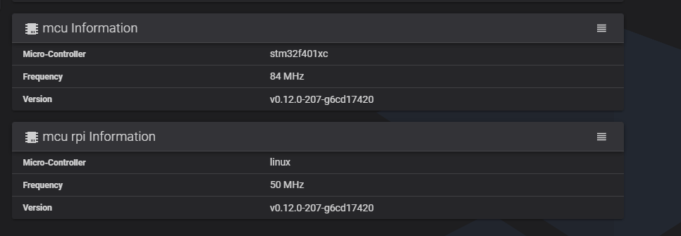

# Обновление 3D-принтера Infimech TX(Flyingbear S1) с Klipper 10 до Klipper 12

[](https://github.com/jimmyjon711/InfimechTxUpgrade/blob/main/README.md)

Руководство/скрипт все еще находятся в стадии разработки, но этого уже достаточно для обновления до klipper 12.
Моя конечная цель - выяснить, какие службы не нужны (да, я думаю, что такие есть),
и удалить ненужный мусор в пользовательской папке MKS.

# Предупреждение:
## **<span style="color:red">Выполняйте это на свой страх и риск, я не несу ответственности, если что-то произойдет во время выполнения этого скрипта. Настоятельно рекомендуется создать резервную копию.</span>**

# Что делает этот скрипт:
- Выполняет резервное копирование конфигурационных файлов и их восстановление после удаления, а затем повторной установки klipper и moonraker.
- Сохраняет всю историю печати
- Вы не должны увидеть разницы, после работы скрипта
- Webcamd и сенсорный экран по-прежнему работают в обычном режиме
- Перекомпилирует RPI микроконтроллер
- Сначала исправляет "sources.list" так, чтобы вы могли обновиться (только до того, что находится в архиве) и применяет исправления безопасности.
  - Дальнейшая работа: сборка Armbian 24 и обеспечение правильной работы .... (Пока не готово)

# Что этот скрипт НЕ ДЕЛАЕТ:
- Скрипт не обновляет микроконтроллер STM32 до версии klipper 12 автоматически,
обновление микроконтроллера нужно выполнять вручную, процесс обновления описан в конце этого [документа](#ручное-обновление-микроконтроллера)

# Подготовка:
Следующие шаги предназначены для создания резервной копии и перехода на модуль eMMC с большим объемом.
- Приобретите **Адаптер eMMC на USB**: [MKS USB3 Адаптер - AliExpress](https://www.aliexpress.com/item/1005005614719377.html) или [Адаптер в комплекте с eMMC - AliExpress](https://www.aliexpress.com/item/1005005998925775.html)  
 или  
 Приобретите **eMMC** [Версия на 32GB(без адаптера)](https://kingroon.com/products/upgrade-32gb-eMMC-module-for-kingroon-kp3s-pro-v2-and-klp1?_pos=2&_sid=4770b8958&_ss=r) или [Версия на 32GB(без адаптера) - AliExpress](https://www.aliexpress.us/item/1005006843564876.html).
- Если вы используете ту же карту eMMC, создайте резервную копию всех файлов из `/home/mks/klipper_config`.
- Выключите принтер и получите доступ к **плате**, открутив все винты посередине и ослабив те что по краям.
**НЕ выкручивайте винты расположенные по краям полностью, так как они удерживаются т-гайками.**
- Выкрутите крепежные винты, которыми крепится модуль eMMC, и осторожно снимите его.

## Создание резервной копии eMMC модуля (Крайне рекомендуется):
Windows(не тестировалось):
- Используйте программу [usbimager](https://gitlab.com/bztsrc/usbimager) и следуйте инструкциям к ней.

Unix:
1. Вставьте модуль eMMC в USB-адаптер и вставьте его компьютер, убедитесь, что модуль вставлен правильно.
2. Выполните комманду:
    ```
    dd bs=4m if=/dev/sdX | gzip > infimechTx_bak.img.gz
    ```
3. Извлеките модуль
4. В случае если переходите на модуль большего объема:
    - Замените модуль eMMC на более крупный модуль
    - Используйте [balena etcher](https://etcher.balena.io/) для перепрошивки на новый eMMC при переходе на диск большего размера
5. Извлеките модуль

## Установка:
1. Вставьте eMMC обратно в материнскую плату (подождите, пока все заработает, прежде чем снова прикручивать нижнюю крышку).
2. Включите принтер
3. Подключитесь к принтеру через SSH или порт

### SSH (Необходимо подключение к роутеру или свичу)
- Определение ip принтера 2 возможных варианта:  
  a. Используя веб интерфейс вашего роутера  
  b. Используя [**AngryIP**](https://angryip.org/download/) (`Settings Cog` > `Ports` > Удалить все `port selection`, впишите `7125`, `Ok`, затем `Start`)
- Подключение с помощью SSH используя: `ssh mks@IP вашего принтера`. Пароль: `makerbase` или `ifbase520`.

### Порт (В случае отсутствия подключения к сети)
1) Подключите компьютер к порту USB-C принтера  
  a. Пользователи `Windows` могут использовать программу [**PuTTY**](https://www.chiark.greenend.org.uk/~sgtatham/putty/latest.html). Вот полезный [**гайд**](https://pbxbook.com/voip/sputty.html) по ее использованию.  
  b. Пользователи `Linux` могут воспользоваться `screen` для доступа из терминала(Команды Linux приведены ниже).
    ```
     lsusb
    ```
    Найдите соответствующее устройство ttyACM / ttyUSB, затем вставьте свое в приведенную ниже команду.
     ```
     screen /dev/tty* 1500000
     ```
     Чтобы выйти, нажмите `Ctrl + A`, затем `K`, затем подтвердите нажатием `Y`.
2) После подключения войдите в систему, используя: Пользователь: `mks`. Пароль: `maker base` или `ifbase520`.

# Загрузка и запуск скрипта
1. Скачайте скрипт используя команду:
    ```
     wget https://raw.githubusercontent.com/jimmyjon711/InfimechTxUpgrade/main/infimechTxUpgrade.sh && chmod +x ./infimechTxUpgrade.sh
    ```
2. Запустите скрипт используя команду:
    ```
    ~/infimechTxUpgrade.sh
    ```
3. Запустите все шаги на выполнение введя `a` или вручную выбирайте все шаги с первого по восьмой
4. Смотрите разделы с запросами на ввод
5. После окончания работы скрипта перезапустите принтер введя команду:
    ```
    sudo reboot
    ```
6. Выполните опциональные шаги после того как убедитесь что все работает

### Обновление armbian:
1. Введите `Y` для обновления, `N` для продолжения без обновления

### Настройка часового пояса:
1. Перейдите в раздел `Personal` > `Timezone`, чтобы задать свой часовой пояс.
2. Выйдите

### Запуск Kiauh:
1. Нажмите `Y`, чтобы обновить и перезапустить программу.
2. Нажмите `Y`, если Kiauh обновлен.
3. Включите автоматическое резервное копирование перед обновлением (необязательно)
4. Введите (`6`) для перехода в раздел `Настройки`.
5. Введите (`4`) для **<span style="color:green">Включения</span> автоматического резервного копирования перед обновлением**  
Теперь должно показывать - <span style="color:red">Отключить</span> автоматическое резервное копирование перед обновлениями
6. Введите (`b`), чтобы вернуться назад
7. Пришло время удалить и установить все установленные на данный момент плагины
    - Удаление:
      1. Введите (`3`) для `[Удаления]`
      2. Введите (`1`) для удаления `[Klipper]`
      3. Введите (`2`) для удаление `[Moonraker]`
      4. Если у вас установлены какие-либо другие плагины (например, mobileraker), обратите внимание на то, что вы установили, и удалите их прямо сейчас.  
         **<span style="color:red">Удалять fluidd не нужно, mainsail еще не был протестирован</span>**
      5. Введите (`b`), чтобы вернуться назад
    - Установка:
      1. Введите (`1`) для `[Установки]`
      2. Введите (`1`) для установки `[Klipper]` - устанавливайте с python 3.x, затем следуйте инструкциям на экране
      3. Введите (`2`) для установки `[Moonraker]` - далее следуйте инструкциям на экране.
      4. Если вы удалили что-то еще, установите это обратно сейчас.
      5. Введите (`b`), чтобы вернуться назад
      6. Установите G-Code Shell Command:
          1. Введите (`4`) для перехода в раздел `[Advanced]`
          2. Введите (`8`) для установки `[G-Code Shell Command]`
              - Введите `Y` для установки на свой страх и риск.
              - Введите `N` для отображения примера
          3. Введите (`b`), чтобы вернуться назад
    - Обновление других плагинов
      1. Введите (`2`) для `[Обновления]`
      2. Введите (`4`) для обновления `[Fluidd]`
      3. Вручную обновите все остальное
      4. Введите (`b`), чтобы вернуться назад
      5. Введите(`q`), чтобы выйти из kiauh

### Обновление RPI mcu:
Пример: https://www.klipper3d.org/RPi_microcontroller.html#install-the-rc-script  
1. В меню установите для параметра "Microcontroller Architecture" значение "Linux process", затем сохраните и выйдите.

### Завершение:
1. Как только все шаги `1-8` будут выполнены, перезагрузитесь, и все должно работать корректно.
2. Если при перезагрузке вы столкнетесь со следующей ошибкой: **Параметр `position_endstop` недопустим в разделе `stepper_z`**, 
перейдите в свой файл **printer.cfg** и найдите `[stepper_z]`, затем закомментируйте строку `position_endstop: -4`. Сохраните и перезапустите.
3. Установите нижнюю крышку на место
4. Заново проведите калибровку температур, калибровку резонансов, и автолевелинг.
    ```
    PID_CALIBRATE HEATER=extruder TARGET=200
    ```
    ```
    PID_CALIBRATE HEATER=heater_bed TARGET=60
    ```

### Необязательные шаги после того, как все будет проверено и заработает
- Удалите файлы резервных копий конфигурации с помощью параметра `8`

## Включение вебкамеры
- Не используйте CROWSNEST он не работает. Необходимо использовать webcamd.
- Включите веб-камеру с параметром `10` (его можно запустить в любое время)
- В веб-интерфейсе klipper перейдите к **Configuration**
- Откройте файл **webcam.txt** и отредактируйте "camera_usb_options". Убедитесь, что параметр "-d" указывает на вашу веб-камеру.
  - В случае проблем с нахождением вашей камеры выполните следующие команды при подключении по ssh:
    - Установка **v4l-utils**
        ```
        sudo apt get install v4l-utils
        ```
    - Загрузка и запуск `crowsnest helper tool`
         ```
      wget https://raw.githubusercontent.com/mainsail-crew/crowsnest/master/tools/dev-helper.sh && chmod +x ./dev-helper.sh && dev-helper.sh -c
        ```
    - Теперь должно выглядеть следующим образом
      
    - Укажите устройство для параметра `-d`. На скриншоте параметр `-d` должен быть `/dev/video4`.

## Ручное обновление микроконтроллера

Следующие инструкции были предоставлены **Golden Greek**

В этом процессе предполагается, что вы уже запустили файл InfimechTXUpgrade.sh из этого репозитория,
чтобы сначала перейти к klipper 0.12!  От этого зависит структура каталогов, которую предполагают эти шаги.

1. Подключитесь по SSH к вашему принтеру используя логин: `msk` пароль: `makerbase` или `ifbase520`
2. Выполните команду `cd kiauh`
3. Запустите скрипт `./kiauh.sh`
4. При появлении запроса на обновление введите "Y", а затем повторно запустите приведенную выше команду, чтобы перезапустить kiauh.
5. Введите (`4`) для перехода в режим `advanced`
6. Введите (`2`) для запуска сборки  
   Вы увидите окно настройки Klipper:
   
   Измените следующие настройки:
   - Установите `Micro-Controller Architecture` значение `STMicroelectronics STM32`
   - Установите `Processor Model` значение `STM32F401`
   - Убедитесь, что `Bootloader offset` установлено на `32Kib bootloader`
   - Убедитесь, что `Communication interface` установлено на `USB (on PA11/PA12)`
   - Нажмите `Q` и `Yes`, когда появится запрос на сохранение конфигурации

   Теперь KIAUH скомпилирует вашу прошивку:

7. Введите `B` и нажмите enter, чтобы вернуться назад, затем введите `Q` и нажмите enter, чтобы выйти из KIAUH.
8. Введите следующую команду, чтобы переименовать и скопировать файл, чтобы вы могли загрузить его из fluidd:
   ```
   cp ~/klipper/out/klipper.bin ~/printer_data/config/mks_skipr_mini.bin
    ```
9. Перейдите в веб-интерфейс вашего принтера и загрузите файл `mks_skip_mini.bin`
10. Скопируйте загруженный файл на карту microSD.
11. Этот слот расположен на материнской плате, и для доступа к нему не требуется снимать нижнюю крышку.
Сбоку есть отверстие, в которое можно незаметно вставить карту памяти, если вы хорошо ее видите.
(Но будьте осторожны, если вы уроните его, то вам придется снять нижнюю часть, чтобы извлечь sd-карту)  
Проще всего снять левую боковую панель, чтобы вставить карту памяти.  Нижнюю часть снимать не нужно.
12. Включите принтер, как только вы сможете перейти к веб-интерфейсу, перейдите в раздел `System` (второй снизу вариант слева).
13. Проверьте, что в `mcu information` отображается версия **v0.12.0-xxxxxxxxxxxxx** (см. рисунок ниже),
ваши крестики будут отличаться в зависимости от того, когда klipper был загружен с github.
    
14. Выключите принтер, затем извлеките SD-карту из гнезда.